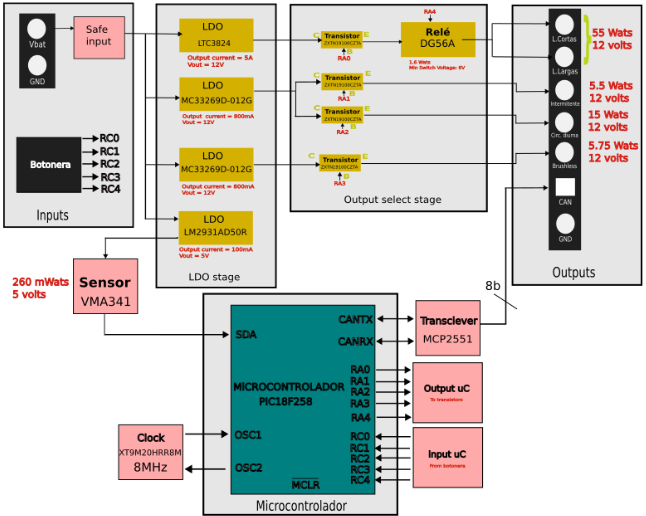

View this project on [CADLAB.io](https://cadlab.io/project/28977). 

DIJOUS_JordiMax_Llums

## Autors
- Max Pérez (@maxperez58)
- Jordi Godàs (@Jordi_Godas)

## Versió - v1.0 ## Curs - Assignatura de Disseny de PCBs amb KiCad - [Curs 2024-2025]

## Objectiu Descripció breu de l'objectiu del projecte.

L'objectiu d'aquest projecte és la realització d'un sistema de control per els diferents tipus de llums d'un vehícle automòvil. A més a més, s'ha incorporat un motor per al control de l'escombreta neteja-fars.

## Requisits i especificacions
- Llums curtes.
- Llums d'encreuament.
- Llums de circulacio dïurna.
- Intermitents.
- Motor escombreta neteja-fars.
- Sensor digital de llum, per activar les llums.

## Diagrama de blocs (Afegiu una imatge del diagrama de blocs)

## Taula de components
| Descripció | Manufacturer Number | Package | Datasheet | Proveïdor | Unitats |
|------------|--------------------|---------|----------|----------|---------|
| LDO-5V | ADM7172ACPZ-5.0-R7 |SMD| https://www.mouser.es/datasheet/2/609/ADM7172-3121160.pdf| Mouser | 1 |
| LDO-3.3V | ADP7112ACBZ-3.3-R7 |SMD| https://www.mouser.es/datasheet/2/609/ADP7112-3121706.pdf| Mouser | 1 |
| Sensor de llum | BH1750FVI-TR |SMD| https://www.mouser.com/catalog/specsheets/Rohm_11162017_ROHMS34826-1.pdf| Mouser | 1 |
| Relé | G5LE-1 DC12 |TO-220| https://www.mouser.es/datasheet/2/307/en_g5le-3447037.pdf| Mouser | 1 |
| Buck converter | LM2596T-ADJ |SMD| https://www.ti.com/lit/ds/symlink/lm2596.pdf| Texas Instruments | 1 |
| Transciever| MCP2551-I-SN |SMD| https://ww1.microchip.com/downloads/en/devicedoc/21667d.pdf | Texas Instruments | 1 |
| Microcontrolador | PIC18F2580-I/SO |SMD| https://www.mouser.es/datasheet/2/268/39637d-3443674.pdf | Mouser | 1 |
| Transistor BJT | Si7336ADP |SMD| https://www.vishay.com/docs/73152/si7336adp.pdf| Mouser | 4 |
| Transistor MOS | ZXTN19020DFFTA |SMD| https://www.diodes.com/assets/Datasheets/ZXTN19020DFF.pdf | Mouser | 5 |
| Traductor (3.3V-5V) | PCA9306D |SMD|https://www.ti.com/lit/ds/symlink/pca9306.pdf?ts=1743021004009&ref_url=https%253A%252F%252Fwww.ti.com%252Fproduct%252FPCA9306 | Mouser | 1 |
| Sensor hall | TMAG5124G1CEDBZRQ1 |SMD| https://www.ti.com/lit/ds/symlink/tmag5124-q1.pdf?ts=1743694512003&ref_url=https%253A%252F%252Fwww.mouser.es%252F | Mouser | 1 |
| Cristall | XT9M20HRR8M |SMD| https://datasheet.octopart.com/XT9M20ANA8M-Vishay-datasheet-41303490.pdf | Mouser | 1 |

## Funcionalitats
- [ ] Funció 1
- [ ] Funció 2
- [ ] Funció 3

## Historial de canvis 
| Data | Autor | Branch | Descripció |
|------|------|--------|------------| 
| 2025-03-17 | Max Pérez | `main` | Creació del projecte |
| 2025-03-17 | Max Pérez | `main` | LDO y output select stage |
| 2025-03-18 | Max Pérez | `main` | Conexiones básicas micro|
| 2025-03-18 | Max Pérez | `main` |Bloque transceiver, safe input y Clock|
| 2025-03-18 | Max Pérez |  `main` |Mejora estética|
| 2025-03-19 | Jordi Godàs | `main`|Acabar el diagrama de blocs 1.0|
| 2025-03-19 | Jordi Godàs |  `main` |Acabar el power point de la presentació|
| 2025-03-21 | Max Pérez | `main` |Creación esquemático 1.0|
| 2025-03-21 | Max Pérez | `main` |Bloques Clock, Communication, Digital Esquemático 1.0|
| 2025-03-21 | Max Pérez |  `main` |Bloques Input, Sensor, Power Esquemático 1.0|
| 2025-03-22 | Max Pérez |  `main` |Mejora etapa Power cambiando DC/DC + LDO por Buck|
| 2025-03-21 | Max Pérez | `main` |Capacidades desacoplo, comentar esquemático y bloque output|
| 2025-03-24 | Max Pérez |  `main` |Simulación Power stage (1 buck y 2 LDO). Exitosa|
| 2025-03-25 | Max Pérez |  `main` |Simulación Power stage (1 buck y 2 LDO) v2 y simulación Puente H|
| 2025-03-27 | Jordi Godàs |  `main` | Actualizar presentacion |
| 2025-03-27 | Jordi Godàs |  `main` | Actualizar el diagrama de bloques y el esquematico con lo dicho en clase por el profesor |
| 2025-03-29 | Max Pérez |  `main` |simulación Puente H v2|
| 2025-03-31 | Max Pérez |  `main` |Placement algunos componentes, separación planos masa y potencia. Routing Transciever, puente H y algun Input Output|
| 2025-04-02 | Jordi Godàs |  `main` | Acabar el layout de la pcb |
| 2025-04-02 | Jordi Godàs |  `main` | Actualizar presentacion |
| 2025-04-02 | Max Pérez |  `main` |GND de SMD + algun ruteo puntual. DRC sin errores|
| 2025-04-03 | Jordi Godàs |  `main` | Cambio del LDO-3.3V y placement en el esquematico |
| 2025-04-03 | Jordi Godàs |  `main` | Update readme |
| 2025-04-06 | Jordi Godàs |  `main` | Update pcb, bigger paths and better organitzation |
| 2025-04-06 | Jordi Godàs |  `main` | Update schemetatic, minor changes |
| 2025-04-07 | Jordi Godàs |  `main` | Finished layout, ERC passed |
| 2025-04-07 | Max Pérez |  `main` | Update readme |

